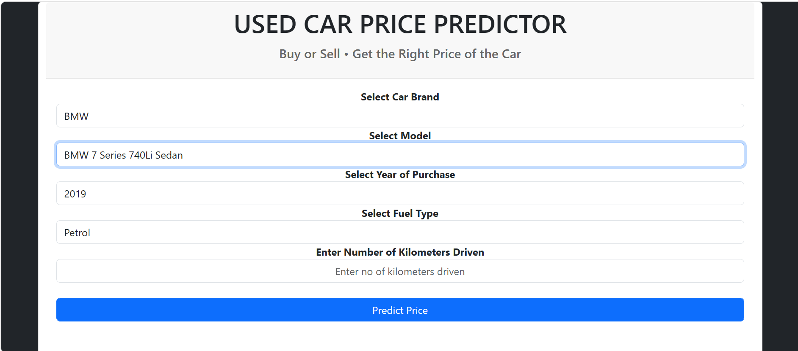
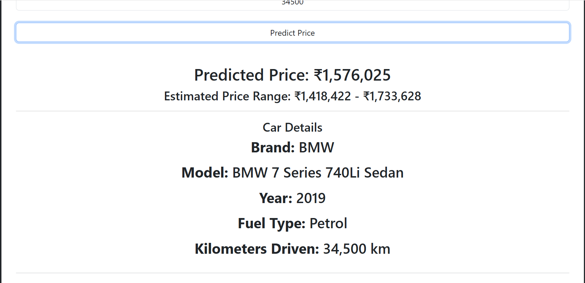
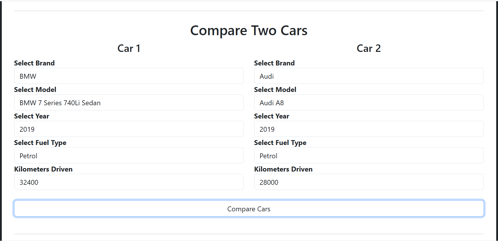
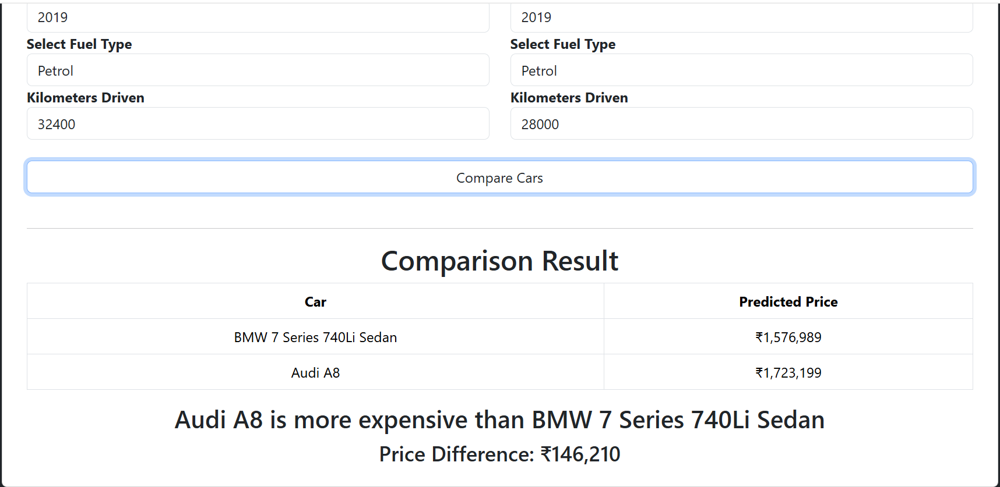

# Used-Car-Price-Predictor

Machine Learning web application for predicting used car prices and comparing two cars based on various features such as brand, model, year, fuel type, and kilometers driven.

---

## Overview

The Used Car Price Predictor is a Flask-based Machine Learning web application that helps users estimate the market value of a used car.

The application uses a trained Linear Regression model to predict car prices based on vehicle specifications and provides:

- Price Prediction
- Estimated Price Range
- Vehicle Details Summary
- Car-to-Car Comparison

---

## Features

### Price Prediction
- Predicts the estimated selling price of a used car.
- Uses a trained Machine Learning model.
- Displays formatted price output.

### Estimated Price Range
- Shows an approximate lower and upper price range.
- Helps users understand possible market variation.

### Vehicle Details
Displays:
- Brand
- Model
- Year
- Fuel Type
- Kilometers Driven

### Compare Two Cars
Users can compare two vehicles simultaneously.

The application displays:
- Predicted price of both cars
- Price difference
- Which vehicle is more expensive

---


## Live Demo

https://used-car-price-predictor-hqgi.onrender.com


## Technologies Used

### Backend
- Python
- Flask
- Pandas
- Pickle

### Machine Learning
- Scikit-Learn
- Linear Regression

### Frontend
- HTML
- CSS
- Bootstrap
- JavaScript
- AJAX

---

## Project Structure

```text
Used-Car-Price-Predictor
│
├── application.py
├── Corrected Cardataset.csv
├── LinearRegressionModel.pkl
├── requirements.txt
├── README.md
│
├── templates
│   └── index.html
│
├── static
│   └── css
│       └── style.css
│
└── screenshots
    ├── Home-page.png
    ├── Prediction-result.png
    ├── Compare-cars.png
    └── Comparison-result.png
```

---

## Project Screenshots

### Home Page



---

### Price Prediction



---

### Compare Cars



---

### Comparison Result



---

## Installation

Clone the repository:

```bash
git clone https://github.com/psb2110-glitch/Used-Car-Price-Predictor.git
```

Move into the project directory:

```bash
cd Used-Car-Price-Predictor
```

Install dependencies:

```bash
pip install -r requirements.txt
```

Run the Flask application:

```bash
python application.py
```

Open your browser and visit:

```text
http://127.0.0.1:5000
```

---

## Machine Learning Workflow

1. Data Collection
2. Data Cleaning
3. Feature Selection
4. Model Training
5. Model Serialization using Pickle
6. Flask Integration
7. Real-Time Prediction

---

## Future Improvements

- Model performance dashboard
- Car depreciation visualization
- Similar car recommendations
- Advanced machine learning models
- Cloud deployment
- Mobile responsive UI improvements

---

## Author

**Priyanshu Sekhar Bhuyan**

B.Tech Computer Science and Engineering Student

GitHub:
https://github.com/psb2110-glitch

---

## License

This project is developed for educational and learning purposes.
